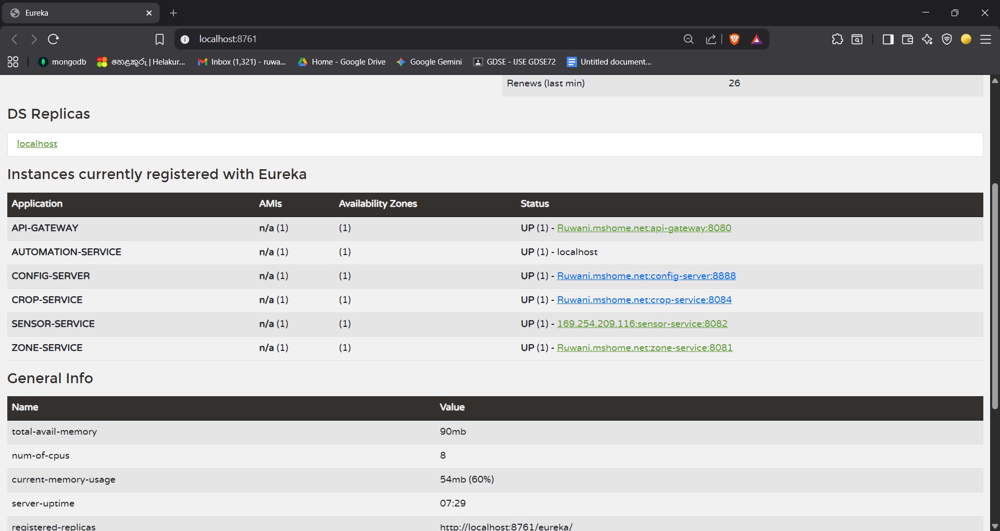
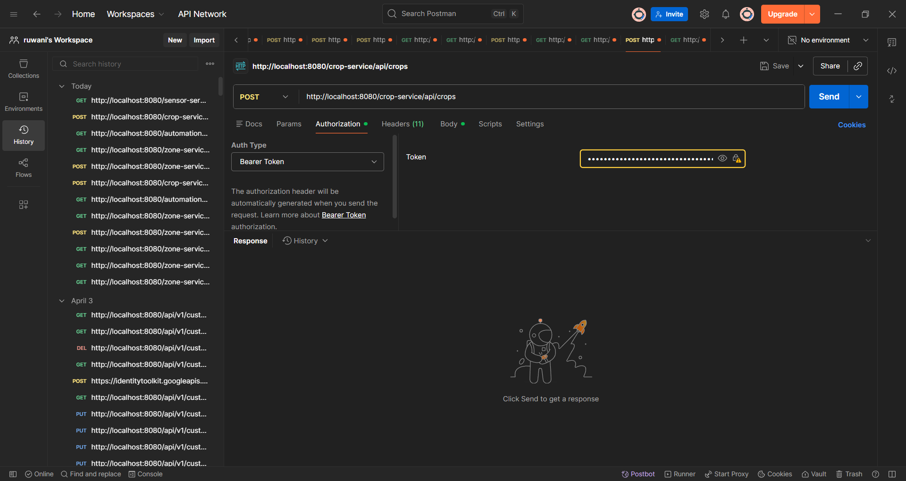

# AGMS: Smart Agricultural Growth & Management System
> **High-Performance Microservices Ecosystem for Precision Greenhouse Automation**

---

## Technical Architecture
This platform utilizes a **Cloud-Native, Polyglot Microservices Architecture** designed for modularity and high availability. It features centralized traffic management and externalized environmental configuration.

### Backbone Infrastructure
* **Edge Gateway (Port 8080):** The primary traffic orchestrator. It handles **JWT-based Authentication** and dynamic request routing.
* **Service Registry (Netflix Eureka, Port 8761):** Provides automated service discovery and real-time health monitoring.
* **Central Config Server (Port 8888):** Manages application properties across all environments.
    * **Config Repository:** [agms-microservices-config](https://github.com/ruwaniranthika/agms-microservices-config.git)

### Service Ecosystem
| Service | Tech Stack | Core Responsibility |
| :--- | :--- | :--- |
| **Zone Management** | Java 21 / Spring Boot | Managing climate thresholds and environment settings. |
| **IoT Sensor Hub** | Python / FastAPI | Integration with **External Telemetry APIs** (104.211.95.241). |
| **Automation Engine** | Node.js / Express | Executing real-time logic for irrigation and ventilation. |
| **Crop Lifecycle** | Java 21 / Spring Boot | Monitoring plant growth stages from seeding to harvest. |

---

## Deployment Validation
To ensure the operational stability of the ecosystem, the following system states have been verified:

### 1. Service Discovery Status
The Eureka dashboard confirms that all distributed services (Java, Node.js, and Python) are successfully registered and communicating.

### 2. Security & Access Control
* **Authorized Access:** Successfully validated requests via Port 8080 using valid tokens.

* **Security Barrier:** The Gateway effectively blocks unauthenticated traffic with a `401 Unauthorized` response.

---

## Security Design

### 1. Centralized Identity Management
Security is enforced at the **North-South traffic** layer (API Gateway):
* **Processing:** A `JwtAuthenticationFilter` intercepts every incoming packet.
* **Verification:** The `JwtUtil` component validates signatures against a **high-entropy secret** fetched from the Config Server.
* **Policy:** No request is forwarded to downstream domain services without a verified `Bearer Token`.

### 2. Architectural Isolation
> [!NOTE]
> **Network Strategy:** In a production-ready environment, only the API Gateway is exposed to the public web. All internal Domain Services reside in **Private Subnets**, ensuring that individual service ports are shielded from external threats.

---

## Setup & Execution

### Prerequisites
* **JDK 21** & **Maven**
* **Node.js (LTS)**
* **Python 3.9+**
* **Databases:** Relational (MySQL) and Document-based (MongoDB) stores.

### Bootstrapping Order
For the ecosystem to initialize correctly, launch the components in this specific sequence:
1. **Eureka Discovery Server** (8761)
2. **Spring Cloud Config Server** (8888)
3. **API Gateway** (8080)
4. **Backend Services** (Zone → Sensor → Automation → Crop)

---

## Engineering Standards Reached
* **Polyglot Integration:** Seamless communication between Spring Boot, FastAPI, and Express.
* **Service Resilience:** Implemented connection timeouts and **fallback logic** for external IoT integrations.
* **Synchronous Messaging:** Utilized **OpenFeign** for structured inter-service REST calls.
* **Modern Standards:** Fully migrated to **Java 21** for enhanced performance and virtual thread support.

---

## Developed By
**Ruwani Ranthika**
*Software Engineering Undergraduate & Full-Stack Developer*
**Institute of Software Engineering (IJSE)**